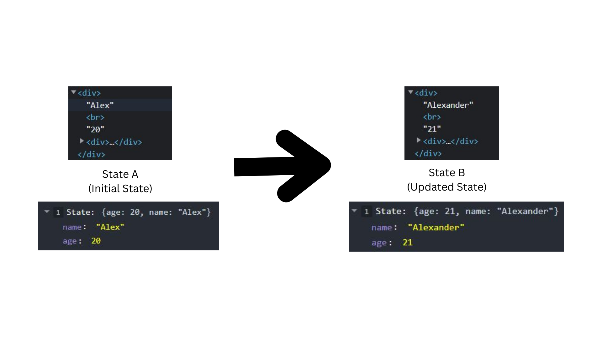

## React Hooks

> Hooks are functions that let you “hook into” React state and lifecycle features from function components.

## UseState() Hook
> The React useState Hook allows us to track state in a function component.
---

---
> [Examples of React State](https://codesandbox.io/s/clever-mayer-84nrtc?file=/src/App.js)